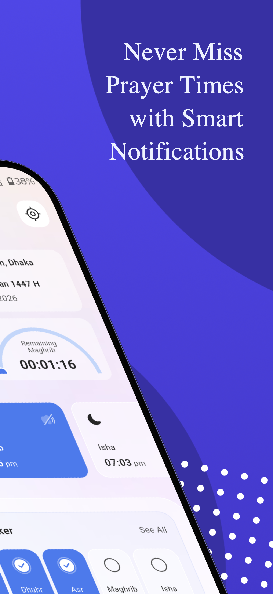
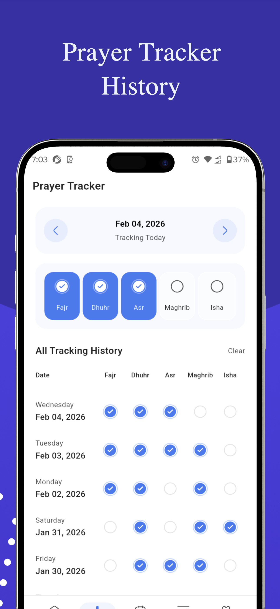
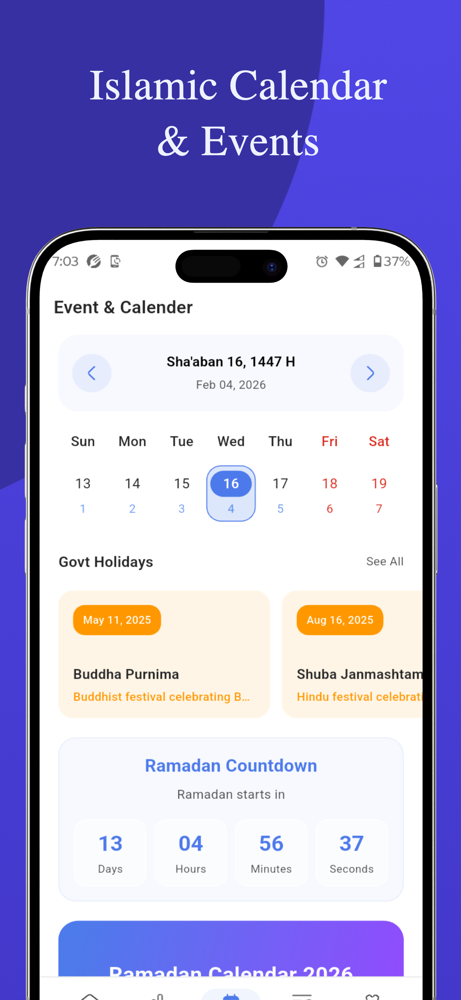
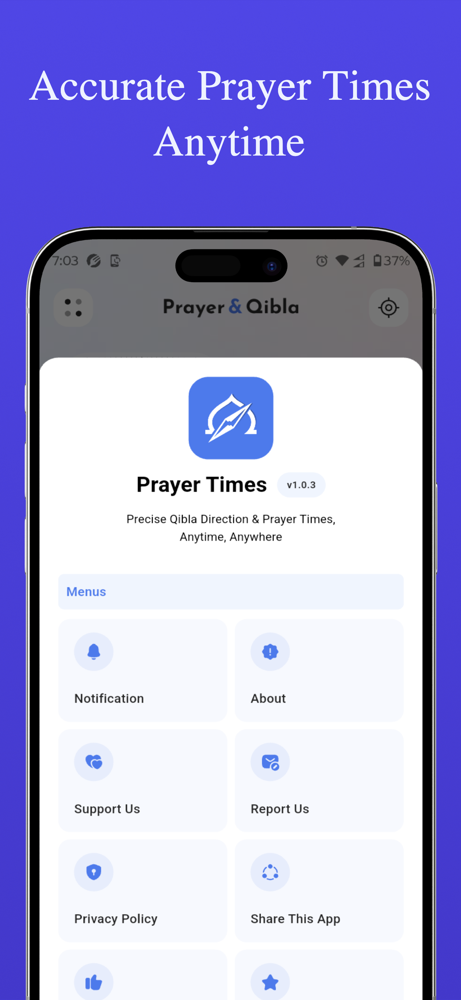

# Prayer & Qibla - Prayer Times App

A comprehensive Islamic prayer times and calendar application built with Flutter. Get accurate prayer times, track your daily prayers, explore the Islamic calendar with Hijri dates, and never miss a prayer with smart notifications.

<p align="center">
  
  
  
  
  
</p>

## Features

### Prayer Times

- Accurate prayer time calculations for **Fajr, Dhuhr, Asr, Maghrib, Isha** along with Sunrise and Duha
- **14 calculation methods** including Muslim World League, Umm al-Qura, ISNA, Karachi, and more
- **Hanafi & Shafi'i** juristic method support
- Real-time clock with **active prayer highlighting** and remaining time countdown
- GPS-based and manual location selection with timezone-aware calculations

### Prayer Tracker

- Track daily prayer completion status (Completed / Missed)
- Full **tracking history** with date-based navigation
- Visual progress indicators for each prayer

### Islamic Calendar & Events

- **Hijri calendar** with adjustable day offset for regional variations
- **Ramadan countdown** timer and dedicated Ramadan calendar with Sehri & Iftar times
- Islamic holidays and events including Eid ul-Fitr, Eid ul-Adha, Laylat al-Qadr, Shab e-Barat, and more

### Smart Notifications

- Firebase Cloud Messaging (FCM) push notifications
- Prayer time reminders so you never miss a prayer
- Platform-aware permission handling for iOS and Android

### Additional

- **In-app update** system via Firebase
- **In-app review** prompts
- Support Us page with bank & mobile payment options
- Contact Us and Share functionality
- Onboarding flow for first-time users

## Architecture

The project follows **Clean Architecture** with an **MVP** presentation pattern:

```
lib/
├── core/               # DI, config, themes, utilities, base classes
│   ├── base/           # BasePresenter, BaseUiState, Result
│   ├── config/         # Themes, colors, screen utilities
│   ├── di/             # Service Locator (get_it) setup modules
│   ├── static/         # Constants, fonts, SVG paths, URLs
│   ├── utility/        # Helpers (UI, color, number, logger)
│   └── external_libs/  # Vendored/custom library code
│
├── domain/             # Business logic (framework-independent)
│   ├── entities/       # Domain models (PrayerTime, Location, Event, etc.)
│   ├── repositories/   # Repository contracts (interfaces)
│   ├── service/        # Domain service interfaces
│   └── usecases/       # Single-responsibility use cases
│
├── data/               # Data access & implementation
│   ├── datasources/    # Local (Hive, Drift/SQLite) & Remote (Firebase, Adhan)
│   ├── models/         # DTOs / data models
│   ├── repositories/   # Repository implementations
│   └── services/       # HijriDateService, IslamicEventService, DB, notifications
│
└── presentation/       # UI layer (MVP)
    ├── home/           # Home screen — prayer times, clock, tracker summary
    ├── prayer_tracker/ # Prayer tracker page & history
    ├── event/          # Islamic calendar, events, Ramadan calendar
    ├── settings/       # Calculation method, juristic method, location, day adjustment
    ├── notification/   # Notification list & details
    ├── onboarding/     # First-run onboarding wizard
    ├── contact_us/     # Contact page
    ├── support_us/     # Donation / support page
    ├── main/           # App shell with bottom navigation & menu drawer
    └── common/         # Shared widgets (app bar, buttons, dialogs)
```

### Key Architectural Decisions

| Concern                  | Solution                                          |
| ------------------------ | ------------------------------------------------- |
| **State Management**     | GetX (`GetxController` + reactive `Obs<T>`)       |
| **Dependency Injection** | `get_it` Service Locator with modular setup       |
| **Error Handling**       | Functional `Either<L, R>` from `fpdart`           |
| **Local Storage**        | Hive (key-value) + Drift/SQLite (structured data) |
| **Backend**              | Firebase (Firestore, FCM, Analytics, Crashlytics) |
| **Prayer Calculation**   | `adhan_dart` — offline calculation engine         |
| **Navigation**           | GetX routing                                      |

## Tech Stack

| Category         | Packages                                                                                                          |
| ---------------- | ----------------------------------------------------------------------------------------------------------------- |
| **Framework**    | Flutter 3.9.2+ / Dart                                                                                             |
| **State & DI**   | `get`, `get_it`, `fpdart`, `rxdart`, `equatable`                                                                  |
| **Prayer Times** | `adhan_dart`, `hijri`, `timezone`, `intl`                                                                         |
| **Firebase**     | `firebase_core`, `cloud_firestore`, `firebase_messaging`, `firebase_analytics`, `firebase_crashlytics`            |
| **Database**     | `drift` + `sqlite3_flutter_libs`, `hive`                                                                          |
| **Networking**   | `dio`                                                                                                             |
| **Location**     | `geolocator`, `geocoding`                                                                                         |
| **UI**           | `responsive_sizer`, `flutter_svg`, `arc_progress_bar_new`, `cached_network_image`                                 |
| **Utilities**    | `logger`, `talker_logger`, `share_plus`, `url_launcher`, `in_app_review`, `device_info_plus`, `package_info_plus` |

## Getting Started

### Prerequisites

- Flutter **3.9.2** or higher
- Dart SDK
- Firebase project configured (add your `google-services.json` / `GoogleService-Info.plist`)

### Installation

```bash
# Clone the repository
git clone https://github.com/royalcourtbd/prayer_times.git
cd prayer_times

# Install dependencies
flutter pub get

# Generate Drift database code
dart run build_runner build --delete-conflicting-outputs

# Run the app
flutter run
```

### Firebase Setup

1. Create a Firebase project at [console.firebase.google.com](https://console.firebase.google.com)
2. Enable **Cloud Firestore**, **Cloud Messaging**, **Analytics**, and **Crashlytics**
3. Add your Android and iOS apps in Firebase console
4. Place `google-services.json` in `android/app/` and `GoogleService-Info.plist` in `ios/Runner/`

## License

This project is licensed under the [MIT License](LICENSE).
